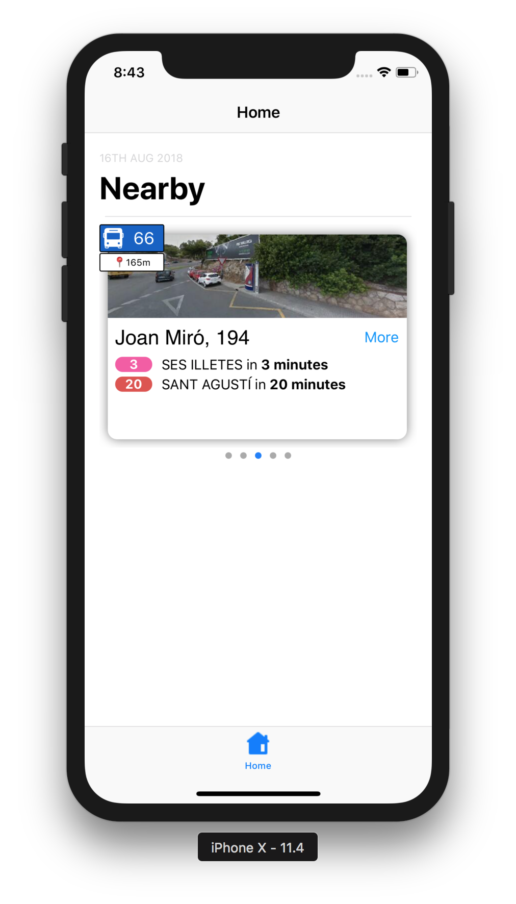

GithubBusApp
-

### What is this?

[Short movie here](https://streamable.com/xairw)

This is my first ever App that I wrote for iOS. It's a bus stop App that calls a couple of external APIs (that I actually shouldn't have access to, so I've remved everything incriminating please don't sue me) to display the 5 closest bus stops to the user's current location and the times of the next arriving buses.

### Why?

The government-provided app sucks and is basically just an Android wrapper around a poorly coded JavaScript app, so I reverse engineered it to understand the authentication mechanism and endpoints, and wrote my own version in Swift for myself and my colleagues for fun!

It's also here to showcase my learning and OO abilities in a language that isn't my favourite one that I use on a regular basis (PHP).  

### Features / Showcases

- OO knowledge, delegation, protocol oriented programming
- What I consider a semi-decent architecture, some not-super-serious DDD stuff thrown in for fun
- Real MVC, which PHP doesn't have
- Configured semi-automatic dependency injection
- Async / Await (so no callback hell it's amazing!!)
- Multithreading with GCD
- Geolocation capabilities
- Reverse engineering of (an effectively) legacy codebase for the lols
- Hopefully, a really nice user interface idea I had
- An attempt at coming up with a data mapper with core data instead of active record - I couldn't _quite_ achieve it without class duplication, but it works
- Docs, you can use Jazzy

All of these things I know more about in PHP (apart from multithreading, I haven't played with pthreads yet), and it makes calls to the google streetview api asynchronously to display the bus stop in streetview at the top (thanks to @amunoz for his idea on that!).

### Does it work?

Nope! I removed all the sensitive files, json containing all the locations of the stops, so you won't actually get it working. But you _can_ take a look and see how I did some of the different stuff in there. I also think I have a `StrategyFactory` in there somewhere, Java fans will immediately sing praises!

### What next?

Well I'm going to continue working on it for fun in my spare time. Next steps:

- Realtime searching
- Maps stuff
- Displaying a bus in 'realtime' with guessing - this algorithm will be fun to write